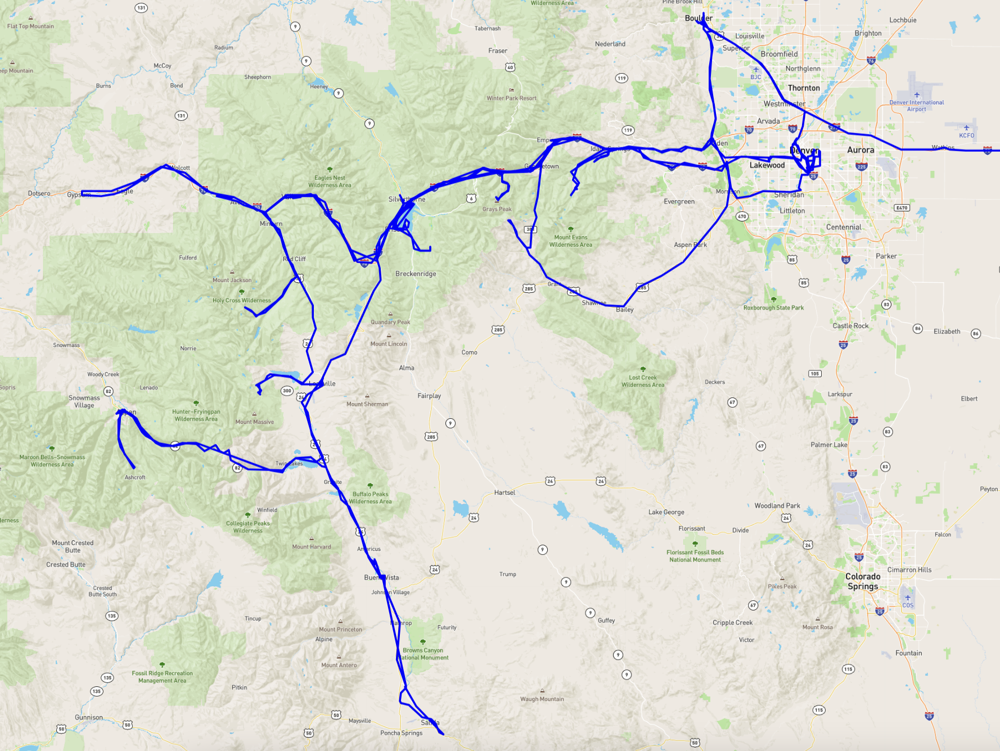

# Location Visualizer with Mapbox and Folium

This project allows you to visualize location data extracted from a Google Maps Timeline history JSON file. It enables filtering locations by timestamp and plotting them on a map using custom Mapbox styles. You can represent the locations as a thin line connecting coordinates and customize zoom levels.

## Steps to Get Started

### 1. Download Google Maps Timeline History

1. Sign in to your Google Account.
2. Go to [Google Takeout](https://takeout.google.com/settings/takeout).
3. Click on "Deselect All."
4. Scroll down to "Location History" and select it.
5. Click on "Next step" and then "Create export."
6. Download the ZIP file once it's ready and extract the "Location History.json" file.

### 2. Obtain a Mapbox API Key

1. Sign up for a free account on [Mapbox](https://www.mapbox.com/).
2. In your account settings, go to the "Access tokens" tab.
3. Create a new token or use the default public token provided.
4. Save the token; you will need to add it to the code later.

### 3. Set Up the Project

1. Clone the repository or download the code.
2. Install the required dependencies: `pip install folium`
3. Rename the "Location History.json" file to "data.json" and place it in the project folder.
4. Open the main script and replace `YOUR_MAPBOX_ACCESS_TOKEN_HERE` with your actual Mapbox access token.
5. Run the script: `python main.py`

### 4. Customize the Map

- You can filter the locations by timestamp by modifying the `start_timestamp` and `end_timestamp` parameters.
- You can change the appearance of the map by selecting different Mapbox styles or altering line properties.
- The map will be saved as `map.html` and can be opened in a web browser.

## Contributing

Feel free to fork the repository and submit pull requests for enhancements and bug fixes. If you have any issues or questions, please open an issue.

## License

This project is licensed under the MIT License - see the [LICENSE.md](LICENSE.md) file for details.
